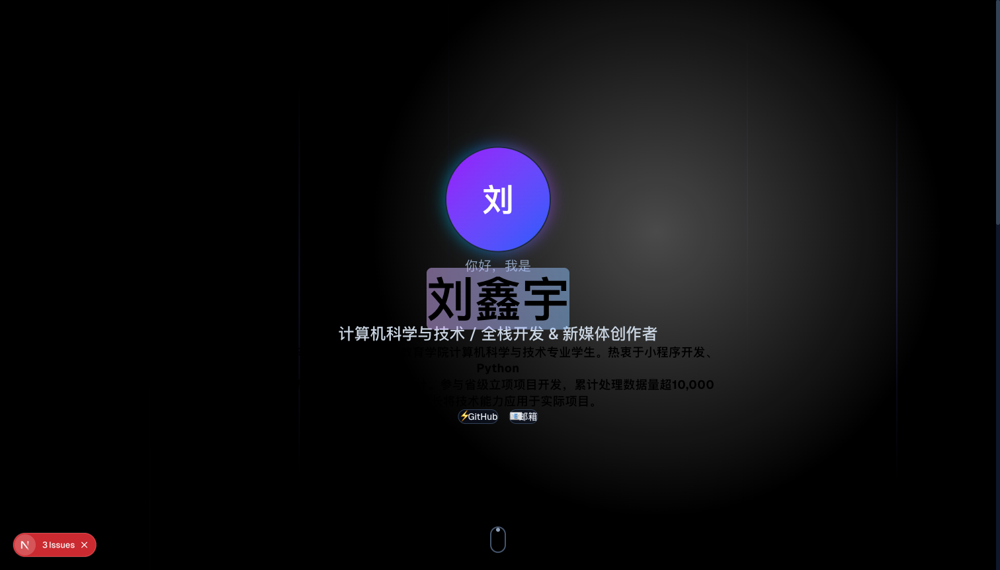
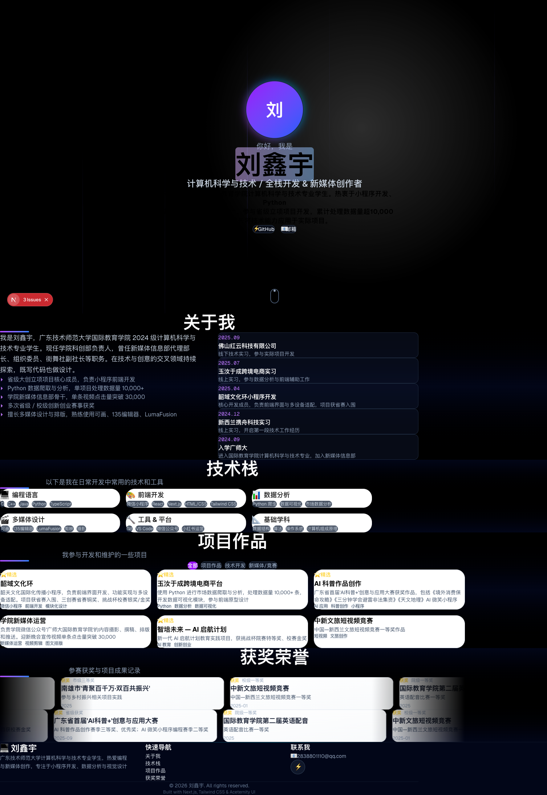

[](./LICENSE)

# yuan-website

刘鑫宇个人作品集网站 — 全栈开发工程师，展示项目经历、技术栈与技术文章。

**在线预览**：https://meteorkid.github.io/yuan-website/

## 功能

- **Hero 区域**：动态打字效果展示个人标签
- **关于我**：教育背景、实习经历与个人介绍
- **技术栈**：分类展示掌握的技术与工具
- **项目展示**：开源项目卡片，含 GitHub 链接与技术标签
- **技术文章**：精选文章列表
- **响应式布局**：桌面端与移动端自适应

## 截图

### 首页 Hero



### 完整首页



## 技术栈

| 层 | 技术 |
|---|---|
| 框架 | Next.js 16 + React 19 + TypeScript |
| 样式 | Tailwind CSS v4 |
| 动画 | Framer Motion |
| 工具 | clsx + tailwind-merge |
| 构建 | Turbopack（Next.js 内置） |
| 包管理 | pnpm |

## 快速开始

```bash
# 克隆仓库
git clone https://github.com/Meteorkid/yuan-website.git
cd yuan-website

# 安装依赖
pnpm install

# 启动开发服务器
pnpm dev
```

访问 http://localhost:3000

### 构建生产版本

```bash
pnpm build
pnpm start
```

## 项目结构

```
yuan-website/
├── app/
│   ├── layout.tsx         # 根布局
│   ├── page.tsx           # 首页（组合所有区块）
│   ├── globals.css        # 全局样式 + Tailwind
│   └── favicon.ico
├── components/
│   ├── Hero.tsx           # 首屏 Hero 区域
│   ├── About.tsx          # 关于我
│   ├── TechStack.tsx      # 技术栈展示
│   ├── Projects.tsx       # 项目卡片
│   ├── Articles.tsx       # 技术文章
│   ├── Footer.tsx         # 页脚
│   ├── Navbar.tsx         # 导航栏
│   └── ui/                # 通用 UI 组件
├── data/                  # 静态数据（项目、文章等）
├── lib/                   # 工具函数
├── public/                # 静态资源
├── package.json
├── tsconfig.json
└── next.config.ts
```

## 可用脚本

| 命令 | 说明 |
|------|------|
| `pnpm dev` | 启动开发服务器（Turbopack） |
| `pnpm build` | 构建生产版本 |
| `pnpm start` | 启动生产服务器 |
| `pnpm lint` | ESLint 代码检查 |

## 部署

推荐使用 Vercel 一键部署：

1. Fork 本仓库
2. 在 [Vercel](https://vercel.com/) 导入项目
3. 自动检测 Next.js，无需额外配置

也可部署到其他支持 Node.js 的平台（Netlify、自托管服务器等）。

## License

[MIT](LICENSE)
